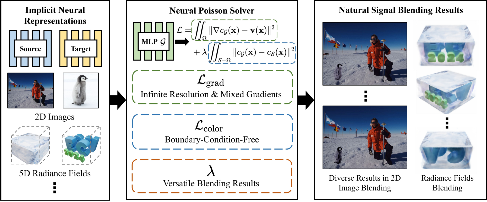

# [ECCV 2024]Neural Poisson Solver: A Universal and Continuous Framework for Natural Signal Blending
PyTorch implementation of Neural Poisson Solver.

## Pipeline


## Setup
We provide a conda environment setup file including all of the above dependencies. Create the conda environment Neural Poisson Solver by running:
```
conda create -n neural-poisson-solver python=3.8
conda activate neural-poisson-solver
pip install -r requirements.txt
```
 
## Running

### 2D scene
For 2D scene blending tasks, we employ [DINER](https://github.com/Ezio77/DINER) as the backbone network. 

#### Data preparation
You need to prepare the following data and place them in the `data/2d/` folder. The directory structure should look like this:
```
data/2d/
├── scene_1/
│   ├── src.pth          # Source scene's INR model
│   ├── tgt.pth          # Target scene's INR model
│   ├── roi.png          # Blending region
│   ├── cfg.npy          # Blending center coordinates
└── ...
```

#### Scene blending
```bash
export PYTHONPATH=$(pwd)
CUDA_VISIBLE_DEVICES=0 python src/blending/blend_2d.py --save_dir results/2d/scene_1/ --root_dir data/2d/scene_1/ --use_numpy False
```

### 3D scene
For 3D scene blending tasks, we employ [NeRF](https://github.com/yenchenlin/nerf-pytorch) as the backbone network.

#### Data preparation
You need to prepare the following data and place them in the `data/3d/` folder. The directory structure should look like this:
```
data/3d/
├── scene_1/
│   ├── src.tar          # Source scene's NeRF model
│   ├── tgt.tar          # Target scene's NeRF model
│   ├── roi.pt           # Blending region
│   ├── cam.json         # Camera parameters
└── ...
```

#### Scene blending
```bash
export PYTHONPATH=$(pwd)
sh src/models/nerf/install_ext.sh
CUDA_VISIBLE_DEVICES=0 python src/blending/blend_3d.py --save_dir results/3d/scene_1/ --root_dir data/3d/scene_1/
```

## Citation
```
@misc{wu2024neuralpoissonsolveruniversal,
      title={Neural Poisson Solver: A Universal and Continuous Framework for Natural Signal Blending}, 
      author={Delong Wu and Hao Zhu and Qi Zhang and You Li and Zhan Ma and Xun Cao},
      year={2024},
      eprint={2407.08457},
      archivePrefix={arXiv},
      primaryClass={cs.CV},
      url={https://arxiv.org/abs/2407.08457}, 
}
```
